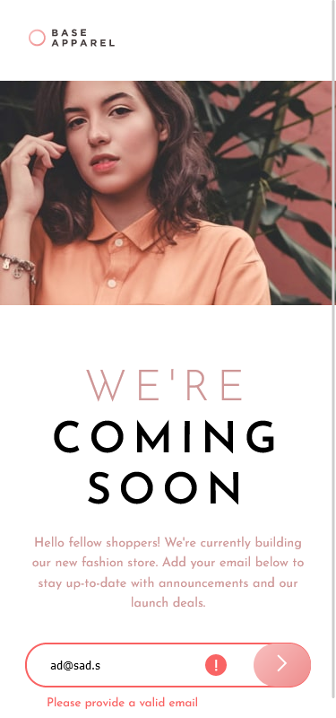

# Frontend Mentor - Base Apparel coming soon page solution

This is a solution to the [Base Apparel coming soon page challenge on Frontend Mentor](https://www.frontendmentor.io/challenges/base-apparel-coming-soon-page-5d46b47f8db8a7063f9331a0). Frontend Mentor challenges help you improve your coding skills by building realistic projects. 

## Table of contents

- [Overview](#overview)
  - [The challenge](#the-challenge)
  - [Screenshot](#screenshot)
  - [Links](#links)
- [My process](#my-process)
  - [Built with](#built-with)
  - [What I learned](#what-i-learned)
  - [Useful resources](#useful-resources)

## Overview

### The challenge

Users should be able to:

- View the optimal layout for the site depending on their device's screen size
- See hover states for all interactive elements on the page
- Receive an error message when the `form` is submitted if:
  - The `input` field is empty
  - The email address is not formatted correctly

### Screenshot

### Links

- Solution URL: [https://www.frontendmentor.io/solutions/grid-page-vanilla-js-for-validation-FKfl1cbHno](https://www.frontendmentor.io/solutions/grid-page-vanilla-js-for-validation-FKfl1cbHno)
- Live Site URL: [https://thespiritcode.github.io/Base-Apparel-coming-soon-page/](https://thespiritcode.github.io/Base-Apparel-coming-soon-page/)

## My process

### Built with

- Semantic HTML5 markup
- CSS custom properties
- CSS Grid
- Mobile-first workflow
- Vanilla JS

### What I learned

First time using grid without libraries (ex. bootstrap). I had no idea grid has so many options. Really enjoyed this challenge.

### Useful resources

- [MDN Grid layout guide](https://developer.mozilla.org/en-US/docs/Web/CSS/CSS_Grid_Layout) - This helped me a lot with building grid layout.
